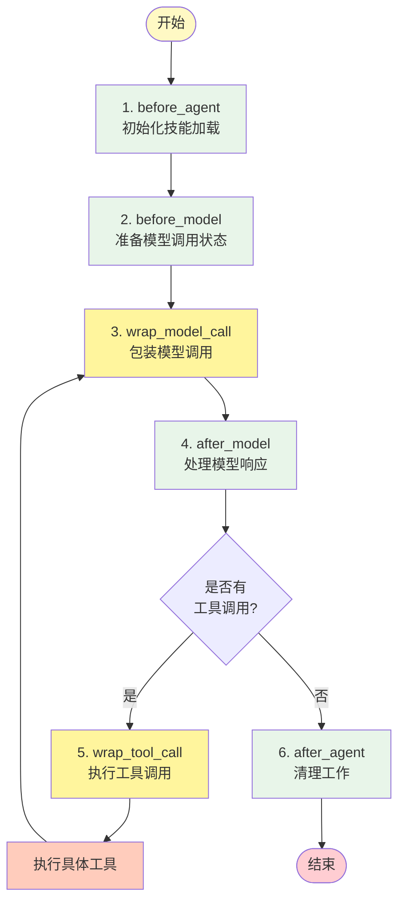

# 多智能体中间件(Middleware)设计

基于 LangChain DeepAgents 的智能体技能调用与执行项目，展示如何通过自定义中间件实现 SKILL 技能文档的读取和执行，以及主子智能体的协同工作。

## 项目概述

本项目基于 **LangChain DeepAgents** 框架，实现了一个**架构视图信息提取系统**。通过自定义 `SkillsMiddleware` 和 `NoSkillsMiddleware` 中间件，实现了技能的渐进式披露加载、主子智能体协同工作、以及智能体内部流程的精细化控制。系统可从用户对话中自动识别并提取 SysMLv2 六种架构视图（需求图、用例图、活动图、状态机图、模块定义图、内部模块图）的相关信息。

**核心技术亮点：**

1. **探究 DeepAgents 模型/工具调用流程**:   通过自定义中间件完整追踪智能体执行生命周期，包括 `wrap_model_call` 和 `wrap_tool_call` 的调用时机与参数传递
2. **探究主子智能体调用方式**:  展示 DeepAgents 的 `task` 工具如何委派子智能体，实现主智能体负责任务路由、子智能体负责具体执行的协作模式
3. **自定义中间件实现 SKILL 技能读取和执行**: 实现 Anthropic 推荐的 Agent Skills 模式，支持 YAML Frontmatter 元数据定义和渐进式技能披露
4. **自定义中间件实现多智能体流程控制**:   通过 `NoSkillsMiddleware` 实现子智能体隔离、工具调用限制和完整执行链路追踪

## 技术架构

### 项目结构

```
one_skill/
├── agent/skills/
│   └── architecture-extractor/     # Skill 定义目录
│       ├── SKILL.md                # 技能元数据与使用说明
│       ├── requirement_prompt.md   # 需求图提取提示词，用于需求提取子智能体
│       ├── usecase_prompt.md       # 用例图提取提示词，用于用例提取子智能体
│       ├── action_prompt.md        # 活动图提取提示词，用于活动提取子智能体
│       ├── state_prompt.md         # 状态机图提取提示词，用于状态提取子智能体
│       ├── bdd_prompt.md           # 模块定义图提取提示词，用于部件定义提取子智能体
│       └── ibd_prompt.md           # 内部模块图提取提示词，用于部件关系提取子智能体
├── skills/
│   ├── __init__.py                 # 中间件导出
│   ├── load.py                     # SKILL 数据定义与加载
│   └── middleware.py               # 自定义中间件实现
├── shell.py                        # Shell 工具中间件
├── prompt.py                       # 系统提示词
├── test_architecture_extractor.py  # 架构提取技能主程序入口
└── pyproject.toml                  # 项目依赖
```

### 架构视图信息提取技能(architecture-extractor)

系统采用**主智能体路由 + 子智能体提取**的分工模式：

**主智能体（Master Agent）**：根据用户输入自动判断所属视图类型，支持多视图分类路由

```
输入: "电池续航≥8小时，参与者有飞行员"
路由: 需求图 + 用例图

输入: "燃油从打开油箱传递到打开发动机"
路由: 活动图 + 内部模块图
```

**子智能体（Sub Agent）**：各子智能体负责对应视图的具体信息提取，支持以下六种视图：

| 视图       | 子智能体              | 说明           | 关键词                       |
| ---------- | --------------------- | -------------- | ---------------------------- |
| 需求图     | requirement-extractor | 系统需求与约束 | 续航≥、符合标准、工作温度   |
| 用例图     | usecase-extractor     | 参与者与用例   | 参与者、利益攸关者、用户目标 |
| 活动图     | action-extractor      | 活动定义与关系 | 活动定义、活动关系、数据流   |
| 状态机图   | state-extractor       | 状态定义与转换 | 状态定义、状态转换           |
| 模块定义图 | bdd-extractor         | 部件定义与组成 | 由...组成、部件定义          |
| 内部模块图 | ibd-extractor         | 部件连接关系   | 连接至、接口、传递           |

### 智能体内部调用流程

智能体核心思想为 **Plan & Execute**，先制定 TODO 计划表，然后按步骤执行。

根据 `./skills/middleware.py` 中导入的官方中间件 `AgentMiddleware`，智能体内部执行流程如下：



> **说明**：`wrap_model_call` 内部包含实际的模型调用过程，中间件在调用前后可以拦截和修改请求/响应数据

**执行步骤说明：**

| 步骤 | 方法                | 说明                                                    |
| ---- | ------------------- | ------------------------------------------------------- |
| 1    | `before_agent`    | 智能体启动时执行，用于初始化技能元数据加载              |
| 2    | `before_model`    | 每次模型调用前执行，准备状态                            |
| 3    | `wrap_model_call` | 包装模型调用，可拦截和修改请求/响应                     |
| 4    | `after_model`     | 模型响应后执行，处理输出结果                            |
| 5    | `wrap_tool_call`  | 工具调用包装器，首次调用默认为 `write_todos` 制定计划 |
| 6    | 循环                | 步骤 3-5 循环执行，直到模型不再调用工具                 |
| 7    | `after_agent`     | 智能体结束时执行，清理工作                              |

### 架构提取技能的主子智能体架构

```
┌─────────────────────────────────────────────────────────────┐
│                      主智能体 (Master Agent)                  │
│  ┌───────────────────────────────────────────────────────┐  │
│  │ SkillsMiddleware                                      │  │
│  │ - 加载 architecture-extractor skill                   │  │
│  │ - 注入技能元数据到系统提示词                           │  │
│  └───────────────────────────────────────────────────────┘  │
│                           │                                  │
│                           ▼                                  │
│  ┌───────────────────────────────────────────────────────┐  │
│  │ 任务分析 → 视图分类 → 并行委派子智能体                  │  │
│  └───────────────────────────────────────────────────────┘  │
└─────────────────────────────────────────────────────────────┘
                              │
        ┌─────────────────────┼─────────────────────┐
        ▼                     ▼                     ▼
┌───────────────┐   ┌───────────────┐   ┌───────────────┐
│ 需求图提取子智能体 │   │ 用例图提取子智能体 │   │ 活动图提取子智能体 │
│ requirement-  │   │ usecase-      │   │ action-       │
│ extractor     │   │ extractor     │   │ extractor     │
│               │   │               │   │               │
│ NoSkillsMiddleware │ NoSkillsMiddleware │ NoSkillsMiddleware │
│ + 专用提示词    │   │ + 专用提示词    │   │ + 专用提示词    │
└───────┬───────┘   └───────┬───────┘   └───────┬───────┘
        │                   │                   │
        ▼                   ▼                   ▼
   ┌─────────┐         ┌─────────┐         ┌─────────┐
   │ JSON输出 │         │ JSON输出 │         │ JSON输出 │
   └─────────┘         └─────────┘         └─────────┘
```

### 核心组件

#### 1. SkillsMiddleware

主智能体中间件，实现 Anthropic 的 Agent Skills 模式：

- **技能发现**：启动时扫描 `agent/skills/` 目录下的所有 SKILL.md 文件
- **元数据注入**：将技能名称和描述注入系统提示词
- **渐进式披露**：智能体按需读取完整技能文档

```python
skills_middleware = SkillsMiddleware(
    skills_dir=USER_SKILLS_DIR,      # 技能目录
    assistant_id="agent",             # 智能体标识
    name="architecture-extractor"     # 中间件名称
)
```

#### 2. NoSkillsMiddleware

子智能体中间件，用于检测子智能体执行环境：

- **无技能加载**：避免子智能体重复加载技能，在 `before_agent`阶段避免加载与主智能体重复的 SKILL
- **流程控制**：支持子智能体退出工具调用循环，如调用 `write_file` 工具后立即停止，避免生成最终结果后再次读写。
- **调试追踪**：记录子智能体的完整执行流程

```python
requirement_middleware = NoSkillsMiddleware(
    name="requirement-extractor"
)
```

#### 3. ShellMiddleware

- Shell 中间件，构造 shell 运行环境，使智能体支持执行 shell 相关指令

## 快速开始

### 环境准备

```bash
# 克隆项目
cd one_skill

# 安装依赖
conda create -n your_env_name python=3.13
pip install -e .

# 配置环境变量
cp .env.example .env
# 编辑 .env 文件，设置 OPENAI_API_KEY 等参数
```

### 运行演示

```bash
# 运行测试
python test_architecture_extractor.py

# 后台运行并保存日志
python test_architecture_extractor.py > output.log 2>&1 &
```

### 自定义测试输入

修改 `test_architecture_extractor.py` 中的 `query` 变量：

```python
# 示例 1: 需求+用例
query = "工作温度：-5℃到10℃"

# 示例 2: 用例
query = "飞控系统的参与者有飞行员"

# 示例 3: 活动+IBD
query = "燃油从打开油箱传递到打开发动机"
```

## 一点经验

- 子智能体 Plan & Execute 时优先调用 `write_todos`，如果提示词不清晰导致 todos 列表长度为 n，那么 `write_todos`将至少调用n+1次，每个todo执行状态变化为：`pending` -> `in_progress` -> `completed`，所以子智能体提示词应该明确列出精简的执行步骤

## 参考资源

- [LangChain DeepAgents 文档](https://github.com/langchain-ai/deepagents)
- [Anthropic Agent Skills 模式](https://www.anthropic.com/research)
- [https://github.com/pingcy/deepagents-demo](https://github.com/pingcy/deepagents-demo)
